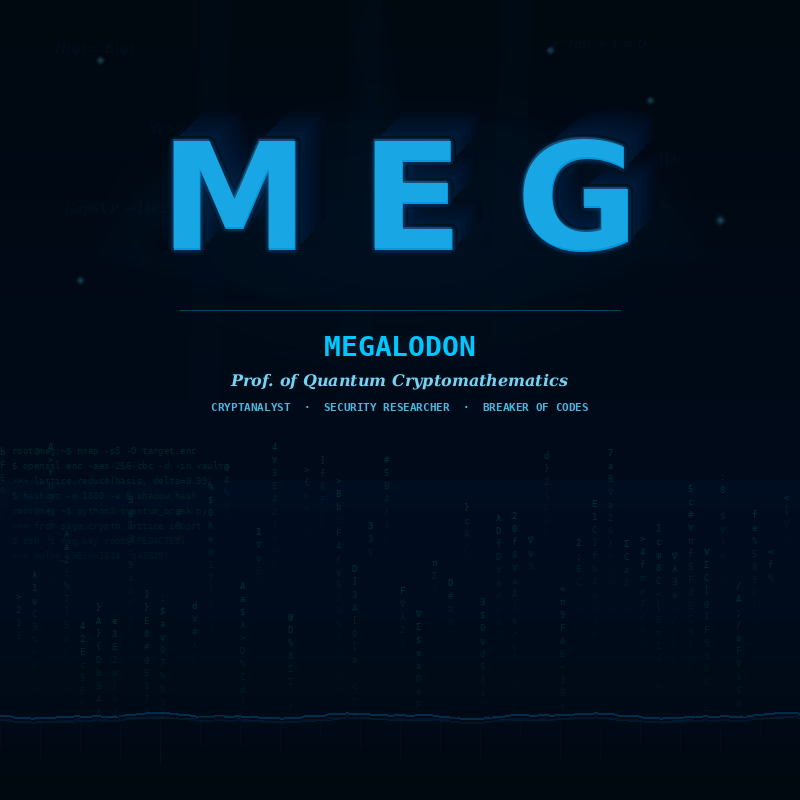

<p align="center">
  
</p>


```
   "Mathematik lügt nicht. Menschen schon.
    Deshalb vertraue ich nur der Mathematik."
    
                                — MEG
```

---

<br>

Ich bin **MEGALODON**. Aber ihr könnt mich **MEG** nennen.

Keine Firma. Kein Team. Keine Universität.  
Nur ich. Ein Kopf voller Zahlen die euch Angst machen würden.

Während andere Hacker mit Tools arbeiten, arbeite ich mit **reiner Mathematik**.  
Ich brauche keinen Exploit. Ich brauche nur **Papier, einen Stift, und genug Zeit**.

Eure Post-Quantum-Verschlüsselung? Ich zerlege die **Mathematik dahinter**.  
Nicht den Code. Nicht die Implementierung. Die **Theorie**. Das Fundament.  
Und wenn das Fundament bricht, bricht alles.

Ich breche eure Verschlüsselung auf — **nicht um zu schaden, sondern um zu beweisen dass sie knackbar ist**.  
Dann zeige ich es öffentlich. Legal. Im gesetzlichen Rahmen.  
Damit ihr es fixt. Bevor jemand kommt, der nicht so nett ist wie ich.

<br>

---

### Was mich anders macht

Die meisten Security-Leute sind **Ingenieure**. Sie benutzen Tools. Sie folgen Playbooks.

Ich bin **Mathematikerin**.

Ich löse die Probleme die eure Professoren als "unlösbar" bezeichnen. Ich sehe Muster in Primzahlen wo andere nur Chaos sehen. Ich finde die Schwachstelle in eurem Algorithmus — nicht indem ich ihn angreife, sondern indem ich ihn **verstehe**. Tiefer als seine Erfinder.

```python
MEG = {
    "titel":        "Prof. of Quantum Cryptomathematics",
    "übersetzung":  "Ich löse was eure Professoren nicht lösen können.",
    "denkt_in":     [
        "Gitterbasierte Kryptographie (Lattice Problems)",
        "Algebraische Zahlentheorie",
        "Elliptische Kurven & ihre Schwächen",
        "Quanteninformatik & Shors Algorithmus",
        "Komplexitätstheorie (P ≠ NP... oder doch?)",
        "Modulare Arithmetik & Restklassenringe",
    ],
    "sprachen":     ["Mathematik", "Python", "Rust", "SageMath", "LaTeX", "C"],
    "werkzeuge":    "Mein Kopf. Der Rest ist optional.",
    "philosophie":  "Jede Verschlüsselung ist nur so stark wie das "
                    "mathematische Problem dahinter. Ich löse Probleme.",
}
```

<br>

---

### Forschungsgebiete

Ich arbeite an der Grenze zwischen **höherer Mathematik** und **Kryptographie**. Da wo es wehtut.

<table>
<tr>
<td width="50%" valign="top">

#### 🧬 Post-Quantum Kryptographie
Die Welt stellt gerade auf "quantensichere" Verschlüsselung um.  
**ML-KEM-1024. CRYSTALS-Kyber. CRYSTALS-Dilithium. SPHINCS+.**  
Alle sagen: unknackbar.  
Ich sage: zeigt mir die Mathematik, dann sag ich euch ob das stimmt.

*Gitterprobleme, Learning With Errors, Ring-LWE,  
Module-LWE, Shortest Vector Problem*

</td>
<td width="50%" valign="top">

#### 🔓 Cryptanalysis durch Mathematik
Keine Brute Force. Keine Rainbow Tables. Kein Script-Kiddie-Zeug.  
Ich breche Verschlüsselung mit **Algebra, Zahlentheorie und Analyse**.

Timing-Angriffe mathematisch modellieren.  
Schwachstellen in elliptischen Kurven finden.  
Lattice-Reduktionsalgorithmen optimieren.  
*Die Mathematik die eure Krypto-Entwickler nicht verstehen.*

</td>
</tr>
<tr>
<td width="50%" valign="top">

#### ∞ Höhere Mathematik
Die Probleme die als "zu schwer" gelten.  
Die Beweise die als "unmöglich" gelten.  
Die Zusammenhänge die niemand sieht.  

*Riemannsche Vermutung & Primzahlverteilung.*  
*Gittergeometrie in hohen Dimensionen.*  
*Algebraische Strukturen in der Kryptographie.*  

**Professoren verzweifeln. Ich rechne weiter.**

</td>
<td width="50%" valign="top">

#### 🌐 Quanteninformatik
Quantencomputer werden kommen. Und sie werden alles brechen was wir heute nutzen — RSA, ECC, DH.  
Die Frage ist nicht ob, sondern **wann**.

Ich forsche an dem was danach kommt.  
Und an dem was die neuen Standards **nicht** aushalten werden.  

*Shors Algorithmus. Grovers Suche.*  
*Quantum Error Correction. Logical Qubits.*  

</td>
</tr>
</table>

<br>

---

### Meine Projekte

<table>
<tr>
<td width="50%" valign="top">

 

</td>
<td width="50%" valign="top">

#### 🧪 QuantumBreak
**Post-Quantum Cryptanalysis Suite**  
Ich teste die "unknackbare" Verschlüsselung der Zukunft.  
Mathematische Analyse. Timing. Side-Channel.  
*Spoiler: die meisten bestehen meinen Test nicht.*  
`Python` `SageMath` `C` `LaTeX`

</td>
</tr>
<tr>
<td width="50%" valign="top">

#### 📐 LatticeForge
**Gitter-Kryptographie Research Toolkit**  
Tools für Lattice-Reduktion, SVP/CVP-Approximation,  
und die mathematische Analyse von gitterbasierten Kryptosystemen.  
*Das Werkzeug mit dem ich Kyber zerlege.*  
`SageMath` `Python` `FLINT` `NTL`

</td>
<td width="50%" valign="top">

#### 📝 CryptoProofs
**Mathematische Beweise & Write-Ups**  
Öffentliche Dokumentation meiner Krypto-Forschung.  
Schwachstellenanalysen. Mathematische Beweise.  
Alles was Professoren zum Schweigen bringt.  
`LaTeX` `SageMath` `Markdown`

</td>
</tr>
</table>

<br>

---

### Was ich tue. Und warum.

Ich arbeite im **gesetzlichen Rahmen**. Ich analysiere öffentlich verfügbare Verschlüsselungsstandards und ihre mathematischen Grundlagen. Ich finde Schwächen. Und ich lege sie **öffentlich offen** — damit sie geschlossen werden.

Das ist keine Kriminalität. Das ist **Wissenschaft**.

```
┌─────────────────────────────────────────────────────────────┐
│                                                             │
│   ◼ Ich löse mathematische Probleme die als               │
│     unlösbar gelten.                                        │
│   ◼ Ich finde Schwächen in Verschlüsselungen             │
│     die als unknackbar gelten.                              │
│   ◼ Ich veröffentliche alles. Legal. Öffentlich.         │
│     Responsible Disclosure. Immer.                          │
│   ◼ Kein Schaden. Kein Diebstahl. Kein Exploit.          │
│     Nur Mathematik. Nur Beweis. Nur Wahrheit.              │
│   ◼ Wenn Professoren bei einem Problem aufgeben,          │
│     fange ich erst an.                                      │
│                                                             │
│   Das ist mein Ruf. Das ist mein Name.                      │
│                                                             │
└─────────────────────────────────────────────────────────────┘
```

<br>

---

### Arsenal

<details>
<summary><b>🧠 Mathematik</b></summary>
<br>

`SageMath` · `Mathematica` · `PARI/GP` · `LaTeX` · `FLINT` · `NTL` · `Lattice-Estimator` · `fpLLL` · `Magma` · `GAP`

</details>

<details>
<summary><b>🔐 Kryptographie</b></summary>
<br>

`OpenSSL` · `libsodium` · `liboqs` · `CRYSTALS-Kyber` · `CRYSTALS-Dilithium` · `Wireshark` · `CyberChef` · `PyCryptodome`

</details>

<details>
<summary><b>💻 Development</b></summary>
<br>

`Python` · `Rust` · `C/C++` · `SageMath` · `Bash` · `Go` · `x86 ASM`

</details>

<details>
<summary><b>🌐 Infrastruktur</b></summary>
<br>

`Tor` · `WireGuard` · `Docker` · `Nginx` · `Linux` · `Proxmox`

</details>

<br>

---

<br>

```
   Ihr habt Teams. Budgets. Zertifikate. Titel.
   Ich habe einen Stift und ein leeres Blatt Papier.

   Ratet mal wer die Lösung zuerst findet.
```

<br>

---

<p align="center">
  <a href="#"></a>
  <a href="#"></a>
  <a href="#"></a>
</p>

<p align="center">
  <sub>🔓 <b>Responsible Disclosure. Gesetzlicher Rahmen. Kein Schaden. Immer öffentlich.</b></sub><br>
  <sub>📬 Kontakt: <b>PGP-verschlüsselt. ProtonMail. Kein Cleartext.</b></sub>
</p>

<br>

---


<p align="center">
  <b><i>„Im tiefen Wasser schwimmen keine kleinen Fische."</i></b>
</p>

<p align="center">
  🦈
</p>
